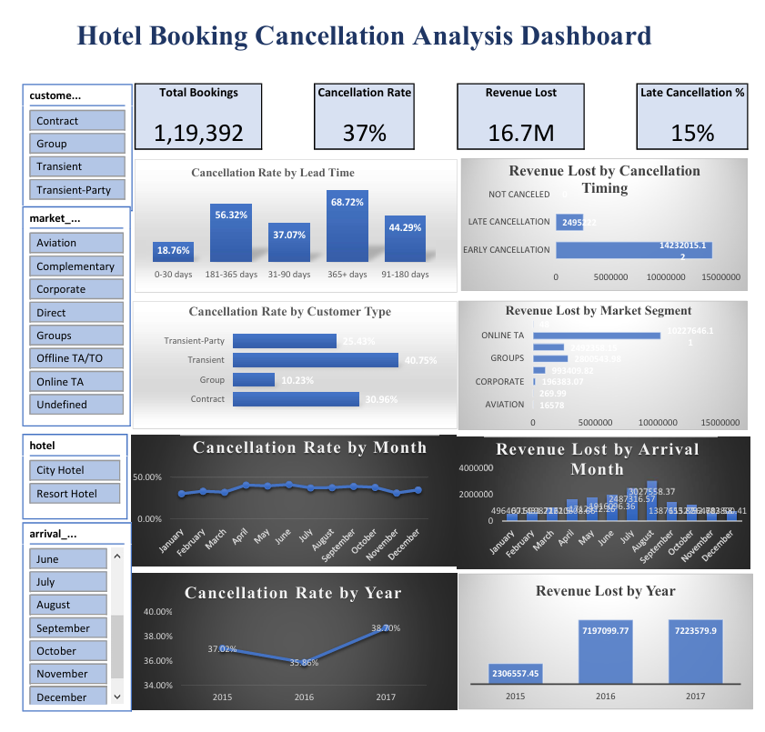

#  Hotel Booking Cancellation Analysis (Excel Data Analytics Project)

## Project Overview

Hotel booking cancellations create major operational and financial challenges for hotels. High cancellation rates lead to **revenue loss, inefficient room allocation, and inaccurate demand forecasting**.

This project analyzes hotel booking data to identify:

* Key **drivers of booking cancellations**
* **Revenue impact** caused by cancellations
* Customer segments with **high cancellation risk**
* **Seasonal patterns** affecting booking reliability

The analysis provides **data-driven insights and business recommendations** to help hotels improve booking policies and reduce revenue leakage.

---

# Dataset Information

| Attribute     | Description                               |
| ------------- | ----------------------------------------- |
| Dataset       | Hotel Booking Demand Dataset              |
| Total Records | 119,392 bookings                          |
| Time Period   | 2015 – 2017                               |
| Hotel Types   | City Hotel, Resort Hotel                  |
| Tool Used     | Microsoft Excel                           |
| Techniques    | Data Cleaning, Pivot Tables, KPI Analysis |

---

#  Project Objectives

The primary objectives of this analysis are:

1. Analyze the **hotel booking cancellation rate**
2. Identify **factors contributing to cancellations**
3. Estimate **revenue loss caused by cancellations**
4. Understand **customer behavior patterns**
5. Provide **actionable recommendations** to reduce cancellations

---

#  Tools & Techniques Used

| Tool               | Purpose                        |
| ------------------ | ------------------------------ |
| Excel              | Data Cleaning & Analysis       |
| Pivot Tables       | Aggregation & KPI calculations |
| Data Visualization | Dashboard creation             |
| Business Analysis  | Insight generation             |

---

#  Key Business KPIs

| Metric            | Value        |
| ----------------- | ------------ |
| Total Bookings    | 119,392      |
| Cancellation Rate | 37%          |
| Revenue Lost      | 16.7 Million |
| Late Cancellation | 15%          |

More than **one-third of hotel bookings are canceled**, creating significant financial impact.

---

# Dashboard

Below is the Excel dashboard built for interactive analysis.

The dashboard includes:

* Cancellation rate by **Lead Time**
* Revenue lost by **Market Segment**
* Cancellation trends by **Month**
* Revenue loss by **Year**
* Customer type risk analysis

---

#  Key Insights

##  Hotel Type Analysis

* **City Hotels:** ~41.7% cancellation rate
* **Resort Hotels:** ~27.7% cancellation rate

City hotels experience significantly higher booking volatility compared to resort hotels.

---

##  Lead Time Impact

Bookings made far in advance show the highest cancellation risk.

| Lead Time    | Cancellation Rate |
| ------------ | ----------------- |
| 0–30 days    | 18.7%             |
| 31–90 days   | 37%               |
| 91–180 days  | 44%               |
| 181–365 days | 56%               |
| 365+ days    | 68%               |

This indicates **uncertainty increases with longer booking lead times**.

---

##  Customer Type Behavior

| Customer Type   | Cancellation Behavior |
| --------------- | --------------------- |
| Transient       | Highest cancellations |
| Transient-Party | Moderate              |
| Contract        | Medium                |
| Group           | Lowest cancellations  |

Transient customers represent the **most volatile booking segment**.

---

##  Market Segment Impact

Highest revenue loss is caused by bookings from:

* **Online Travel Agencies (OTA)**
* **Group bookings**
* **Offline travel agents**

Direct and corporate bookings tend to be **more reliable**.

---

##  Seasonal Cancellation Patterns

Cancellation rates increase significantly during **peak travel months**.

Highest revenue loss occurs during:

* June
* July
* August

Peak-season cancellations create the **largest financial risk for hotels**.

---

#  Revenue Impact

Total estimated revenue lost due to cancellations:

** 16.7 Million**

Revenue loss increased significantly between **2015 and 2017**, indicating higher-value bookings were increasingly affected.

---

#  Booking Risk Classification

###  High Risk Bookings

* Long lead time (180+ days)
* Transient customers
* Online Travel Agency bookings
* First-time guests

###  Medium Risk

* Lead time 30–180 days
* Transient-Party customers
* OTA or Direct bookings

###  Low Risk

* Repeat guests
* Group bookings
* Direct / Corporate bookings

---

#  Business Recommendations

### 1️⃣ Implement Risk-Based Cancellation Policies

Apply stricter cancellation rules for **long lead-time bookings**.

### 2️⃣ Encourage Direct Bookings

Direct bookings show **lower cancellation risk**.

### 3️⃣ Protect Against Peak Season Loss

Use stricter cancellation policies during **high-demand travel months**.

### 4️⃣ Improve Revenue Forecasting

Use cancellation insights to improve **demand forecasting and overbooking strategies**.

---

#  Project Structure

Hotel-Booking-Cancellation-Analysis

│

├── Dataset
│   └── hotel_bookings.csv

├── Excel Dashboard
│   └── hotel_booking_dashboard.xlsx

├── Analysis Report
│   └── insights_summary.pdf

└── README.md

---

#  Future Improvements

* Build **Machine Learning model to predict cancellations**
* Develop **Power BI or Tableau interactive dashboard**
* Implement **customer segmentation analysis**
* Create **predictive analytics for booking risk**

---

#  Author

**Nakka Srikanth**

Aspiring **Data Analyst / Data Scientist**

Skills:

* Python
* Excel
* SQL
* Power BI
* Statistics
* Machine Learning

